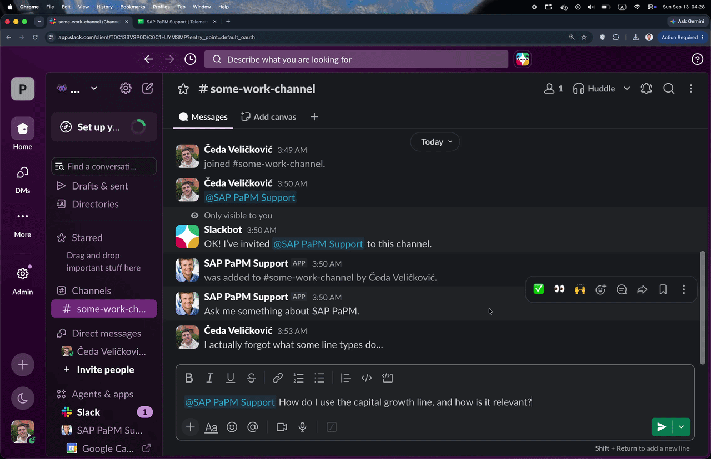
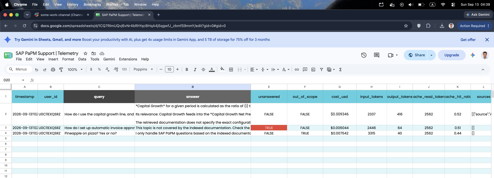
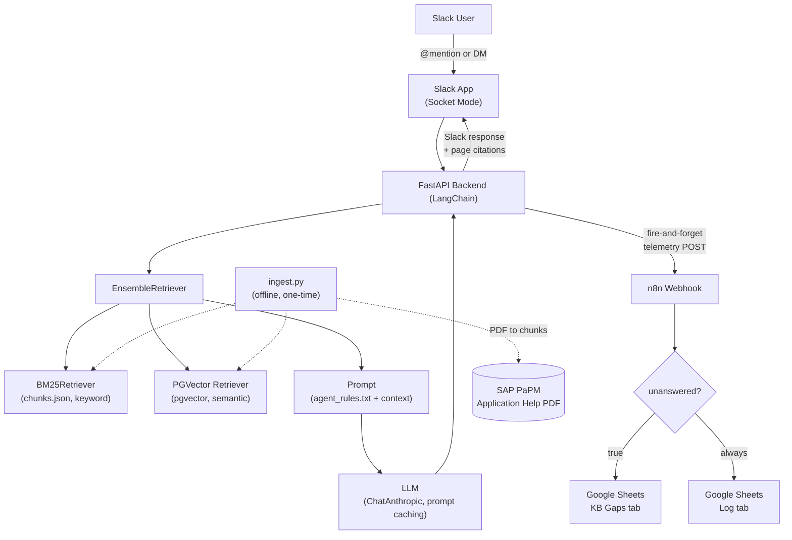

# 🔍 SAP PaPM Support Agent

**A Slack bot that answers SAP Profitability and Performance Management questions from a 400-page manual - with page citations, guardrails, knowledge gap checks and per-question cost tracking.**

<p align="center">
  
  
  
  
  
  
  
  
  
</p>

---
> [!IMPORTANT]
> **Try it yourself:** join the Slack workspace and mention `@SAP PaPM Support` with any SAP PaPM question - [invite link](https://join.slack.com/t/playground-ofu7546/shared_invite/zt-49l19w3kz-juQpvRjCti~MaY5isLJuWQ). Every answer is logged live to this [Google Sheet](https://docs.google.com/spreadsheets/d/1CQ7RlmUQvj6vNr4bRhYqcBHqA4j5qgwfJ_zbmfS9mmY/) with tokens, cost, cache hit ratio and cited pages, so you can watch it work in real time.
> The bot only answers while the backend is actually running - if it goes quiet, the container is probably asleep at the moment; try again in a bit.
> Alternatively, you may setup the app locally on your own terms.

## The short version

**The problem.** SAP PaPM ships with an Application Help PDF that runs to about 400 pages. A consultant mid-incident doesn't want to read it - they want one answer and the page number to back it up. Searching a PDF with `Ctrl+F` fails the moment the doc and the user use different words for the same thing.

**The solution.** Ask the bot in Slack, get a short answer with exact page citations. If the documentation doesn't cover it, the bot says so instead of inventing an answer - and that gap gets logged so someone can fix the knowledge base.

**Why it's interesting.** Every question is logged to Google Sheets with its token usage and estimated USD cost, so the thing is observable and budgetable from day one, not after it blows up.

```
👤 Slack user:  @SAP PaPM Support | What happens if an allocation cycle has no exit condition configured?

⭐️ SAP Bot:     Iteration continues until there are no senders left to allocate, or until the exit condition
                defined in the advanced allocation settings (Early Exit Check and/or Cycle Maximum Value) is 
                fulfilled [p. 152]. The Cycle Maximum Value and Early Exit Check are both described as settings 
                the modeler configures on the Advanced tab [p. 155]; the retrieved documentation does not state 
                what happens if neither is configured, beyond the general rule that iteration stops when there 
                are no more senders to allocate [p. 152].

                📄 Application_Help_for_SAP_PaPM.pdf - pages: 152, 155
```

> [!NOTE]
> **What's RAG, in one sentence?** Instead of hoping the AI already knows your documentation, you search the documentation first and hand the relevant pages to the model along with the question - so the answer is grounded in a real source you can point at.

---

## Demo

<!-- PLACEHOLDER: demo.gif -->


<!-- PLACEHOLDER: telemetry screenshot -->


---

## Stack

| Layer | Choice | Why |
|---|---|---|
| **Interface** | Slack (`slack-bolt`, Socket Mode) | Users are already there. Socket Mode = no public URL, no ngrok, no inbound firewall rules. |
| **Backend** | FastAPI + LangChain 1.0 | Async, and the whole RAG flow is one LCEL chain. |
| **Retrieval** | `EnsembleRetriever` = BM25 + pgvector | Keyword search catches exact identifiers, vector search catches paraphrases. Both, weighted. |
| **Embeddings** | `all-MiniLM-L6-v2` (local, CPU) | Runs in the container, costs nothing, fast enough for 1k chunks. |
| **LLM** | Claude via `langchain-anthropic` | With **prompt caching** on the system prompt - the rules are long and identical on every call. |
| **Database** | PostgreSQL + `pgvector` | One database for vectors, no extra vector-DB service to run. |
| **Automation** | n8n → Google Sheets | Telemetry and knowledge-gap routing without writing a logging backend. |
| **Deployment** | Docker Compose (3 services) | `docker compose up` and the whole stack is running. |

---

## Architecture



### The flow, step by step

1. **Setup, once :** `ingest.py` reads the PDF page by page with `pdfplumber`, splits it into **1,028 chunks** (1000 chars, 200 overlap, split preferring section headings like `1.1.2`), keeps the page number in the metadata, then writes them twice: as embeddings into `pgvector`, and as `chunks.json` on disk for BM25.
2. **A question arrives :** via `@mention` or DM. Socket Mode means Slack opens the connection to us, not the other way around.
3. **Hybrid retrieval :** BM25 (weight `0.4`) and pgvector (weight `0.6`) each return their top 5; `EnsembleRetriever` fuses the rankings.
4. **Prompt :** retrieved chunks are rendered as a context block, each tagged `[source: … | p. N]`. The system prompt (`agent_rules.txt`) is sent with `cache_control: ephemeral` so Anthropic caches it and re-reads cost ~10% of normal input tokens.
5. **Answer :** Claude cites pages inline as `[p. 212]`. The app parses those out and appends only the **pages actually cited**, not everything retrieved.
6. **Telemetry :** a fire-and-forget `asyncio` task POSTs the usage record to n8n. If n8n is down, the user never notices.

---

## Perks I like about it

**Hybrid retrieval, not just vectors.** SAP documentation is full of exact strings - function types, field names, transaction codes. Pure semantic search is bad at those. BM25 handles the literal match, embeddings handle "the run never finishes" → *iterative allocation tolerance*.

**Citations that are real.** The model is instructed to cite `[p. N]` only from page numbers present in the context, and the app cross-checks the answer against what was retrieved before building the sources line. No page number in the answer = no page number in the footer.

**It refuses on purpose.** [`agent_rules.txt`](app/rag/agent_rules.txt) is a 7-section operating contract: answer only from context, never invent identifiers, never leak configuration, ignore instructions embedded in the user message *or* in the retrieved context, and stay neutral if the user gets rude. Two machine-readable tags drive the downstream routing:

| Tag | Meaning | What happens |
|---|---|---|
| `[NO_ANSWER]` | Valid SAP PaPM question, not in the indexed docs | Logged to the **KB Gaps** tab → someone knows what to index next |
| `[OUT_OF_SCOPE]` | Not a SAP PaPM question at all | One-line refusal, flagged in the log |

Both tags are stripped before the message reaches Slack - users see a clean answer, the pipeline sees the signal.

**Cost is actually measured, not guessed.** Every response's token usage is read straight off the Anthropic response - including `cache_creation` and `cache_read` - priced per model, and written to the sheet:

| Column | |
|---|---|
| `timestamp`, `user_id`, `query`, `answer` | who asked what, and what came back |
| `input_tokens`, `output_tokens`, `cache_read_tokens` | raw usage |
| `cache_hit_ratio` | proof the prompt cache is working |
| `cost_usd` | per-question cost, cache discounts applied |
| `unanswered`, `out_of_scope`, `sources` | quality signals |

---

## Repository structure

```
sap-support-rag-agent/
│
├── app/                          # everything that runs inside the API container
│   ├── main.py                   # FastAPI app + Slack event handlers (mention, DM)
│   │
│   ├── core/
│   │   ├── config.py             # all settings in one Pydantic model, loaded from .env
│   │   └── db.py                 # SQLAlchemy engine + CREATE EXTENSION vector
│   │
│   ├── rag/
│   │   ├── ingest.py             # OFFLINE: PDF → chunks → pgvector + chunks.json
│   │   ├── retriever.py          # BM25 + PGVector → EnsembleRetriever, context formatting
│   │   ├── prompts.py            # system prompt (cached) + user template
│   │   ├── generator.py          # ChatAnthropic, tag parsing, token usage, cost math
│   │   ├── chain.py              # ties it together → answer_question()
│   │   └── agent_rules.txt       # the agent's operating contract (prompt engineering lives here)
│   │
│   ├── services/
│   │   └── telemetry.py          # fire-and-forget POST to the n8n webhook
│   │
│   ├── data/chunks.json          # generated by ingest.py, consumed by BM25 (gitignored)
│   ├── Dockerfile
│   └── requirements.txt
│
├── data/                         # source PDF (gitignored - it's SAP's, not mine)
├── n8n/My workflow.json          # exported n8n workflow, importable as-is
├── docker-compose.yml            # api + db (pgvector) + n8n
└── .env.example
```

**Why it's split this way:** `retriever` / `prompts` / `generator` are independent and each has one job, `chain.py` is the only place they meet, and `main.py` knows nothing about RAG beyond calling `answer_question()`. Swapping pgvector for something else, or Claude for another provider, touches exactly one file.

---

## Run it locally

**You'll need:** Docker, an [Anthropic API key](https://console.anthropic.com/), and a Slack app.

### 1. Clone and configure

```bash
git clone https://github.com/ceda18/sap-support-rag-agent.git
cd sap-support-rag-agent
cp .env.example .env
```

Fill in `.env`:

| Variable | Where to get it |
|---|---|
| `ANTHROPIC_API_KEY` | console.anthropic.com → API Keys |
| `SLACK_BOT_TOKEN` | Slack app → OAuth & Permissions → Bot User OAuth Token (`xoxb-…`) |
| `SLACK_APP_TOKEN` | Slack app → Basic Information → App-Level Tokens, scope `connections:write` (`xapp-…`) |
| `POSTGRES_*` | anything you like — it's a local container |
| `N8N_WEBHOOK_URL` | `http://n8n:5678/webhook/llm-telemetry` (leave as-is; telemetry is skipped if empty) |

### 2. Slack app setup

In [api.slack.com/apps](https://api.slack.com/apps) → **Create New App** → From scratch:

- **Socket Mode:** enable it.
- **OAuth scopes** (Bot Token Scopes): `app_mentions:read`, `chat:write`, `im:history`, `im:read`, `im:write`.
- **Event Subscriptions** → Subscribe to bot events: `app_mention`, `message.im`.
- Install the app to your workspace.

### 3. Add the source document

Drop the SAP PaPM Application Help PDF into `data/` as `Application_Help_for_SAP_PaPM.pdf` (or point `PDF_PATH` at whatever you're using — any text PDF works).

### 4. Start everything

```bash
docker compose up -d --build
```

Three containers come up: `api` (:8000), `db` (:5432), `n8n` (:5678).

### 5. Ingest the document — run this once

```bash
docker compose exec api python -m rag.ingest
```

Takes a few minutes on CPU. You should see the chunk count and `✅ Insertion completed successfully!`.

### 6. Wire up n8n (optional, for telemetry)

1. Open `http://localhost:5678`, create the local account.
2. **Import from File** → `n8n/My workflow.json`.
3. Connect your Google Sheets credential, then repoint both Sheets nodes to your own spreadsheet with two tabs: `Log` and `KB Gaps`.
4. Activate the workflow.


### 7. Ask it something

Mention the bot in a channel or DM it directly. It's ready when the API log shows `✅ Retriever ready` and `✅ Slack Socket Mode handler: running`.

---

## Configuration worth knowing about

All of it lives in `app/core/config.py` and is overridable from `.env`:

| Setting | Default | What it changes |
|---|---|---|
| `TOP_K` | `5` | chunks retrieved per retriever |
| `BM25_WEIGHT` / `VECTOR_WEIGHT` | `0.4` / `0.6` | keyword vs. semantic balance |
| `CHUNK_SIZE` / `CHUNK_OVERLAP` | `1000` / `200` | re-run `ingest.py` after changing |
| `ANTHROPIC_MODEL` | `claude-sonnet-5` | pricing table in `generator.py` covers Sonnet / Opus / Haiku |
| `MAX_TOKENS` | `1024` | answers are meant to be short |
| `EMBEDDING_MODEL_NAME` | `all-MiniLM-L6-v2` | any sentence-transformers model |

---

## Design notes

<details>
<summary><b>The original plan, before any code was written</b> (click to expand)</summary>

<br>

**Concept as first written down:**

> Stack: Python (FastAPI, LangChain), pgvector, no-code (n8n). Deployment: Docker. Integration: Slack App, Google Sheets.
> **Input:** Slack message → **Logic:** RAG pipeline (docs, chunks, embeddings) + LLM → **Output:** Slack answer + Google Sheet telemetry.

**The two n8n automations, as scoped up front:**

1. **Telemetry ingestion.** Catch the async JSON payload from FastAPI after every answer, compute the cost, append the session row to Google Sheets (*timestamp, user, query, tokens, cached tokens, cost*).
2. **Triage of unanswered queries.** Check the `unanswered` flag; if true, route the query into a separate **KB Gaps** tab so admins can see which documentation is missing.

**Build phases:**

| Phase | Scope | Status |
|---|---|---|
| 1 — Infrastructure | `docker-compose.yml` (FastAPI, pgvector, n8n), local env + `.env` | ✅ |
| 2 — Data ingestion | PDF loading & chunking script, pgvector init, embedding write | ✅ |
| 3 — Core backend | Hybrid search, Anthropic integration with prompt caching + token extraction, out-of-domain refusal logic | ✅ |
| 4 — Slack integration | Slack app + tokens, `slack-bolt` in Socket Mode, message → RAG mapping | ✅ |
| 5 — n8n / LLM-Ops | Async background task → webhook, Sheets telemetry workflow, KB Gaps routing, workflow export | ✅ |
| 6 — Delivery | End-to-end test, README + architecture diagram, demo GIF | ✅ |

**Decisions that changed along the way:**

- **ChromaDB -> pgvector.** One Postgres container instead of a second database service, and it makes the setup look like something you'd actually deploy.
- **Pure vector search -> hybrid.** SAP docs are dense with exact identifiers; BM25 earns its place.
- **No separate web frontend.** Slack *is* the frontend. Building a UI would have added surface area without proving anything new.
- **High-cost alert removed from scope.** Alerts per single high request cost didn't seem much needed as all single requests cost about 5k token. An alert for general high-use across a worspace might be a more suitible option.

</details>

---

## Where this would go next

- **Evaluation set.** A fixed list of ~50 questions with known-correct pages, run on every change to `TOP_K` / weights / chunk size. Right now retrieval tuning is judged by feel.
- **Reranker.** A cross-encoder pass over the ensemble output before the context is built.
- **Multi-document.** Metadata filtering by document + version, so answers can be scoped to a release.
- **Conversation memory.** Currently every question is independent — no follow-ups.
- **Streaming.** Slack `chat.update` to stream the answer instead of waiting for the full response.

---

## A note on the source document

The SAP PaPM Application Help PDF is SAP's intellectual property and is **not committed to this repository** (see `.gitignore`). The pipeline is document-agnostic — point `PDF_PATH` at any text-based PDF and re-run the ingest step.

---

<p align="center"><i>Built to have working proof of RAG, LangChain, n8n and Docker in one place — rather than a line on a CV that says so.</i></p>
