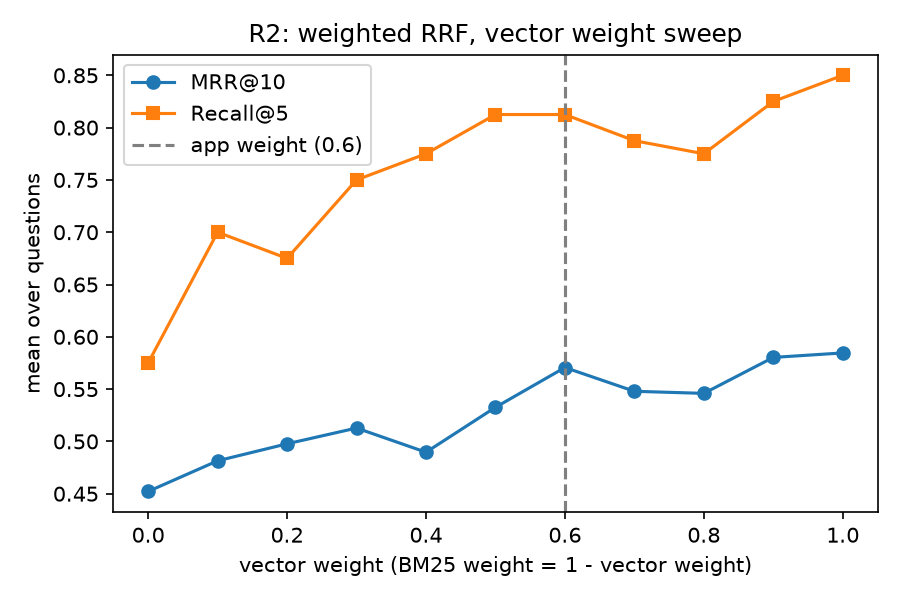
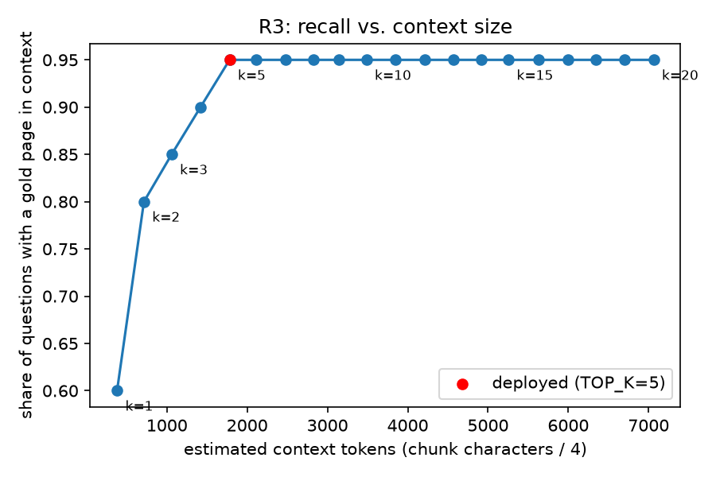

# Offline evaluation of the SAP PaPM RAG agent

Retrieval evaluation of the hybrid retriever (BM25 + pgvector, fused by LangChain's
`EnsembleRetriever`). Everything here measures the real app objects; nothing is
re-implemented. Generation evaluation is planned but not done yet.

## Dataset

`dataset/questions.jsonl`, 50 questions, frozen in git before the first run.

| type | n | how it was made |
|---|---|---|
| synthetic | 30 | `claude-sonnet-5-5` wrote one paraphrased question per chunk; 45 chunks sampled evenly across the manual (seed 42), 44 generated, reviewed by hand, first 30 valid kept |
| manual | 10 | written by hand, gold pages looked up in the PDF |
| unanswerable | 10 | 5 near-miss (PaPM topic not in the manual), 5 out of domain |

Relevance is labelled per page (`gold_pages`); 2 questions have two gold pages.
Retrieval metrics use the 40 answerable questions.

## Method

1. `retrieval/run.py` stores, for every question, the top 100 chunks from BM25 and the
   top 100 from the vector store, with scores (`runs/retrieval.json`).
2. A parity check compares the app's real `EnsembleRetriever` output with the offline
   fusion in `retrieval/fusion.py`: identical order on 50/50 questions.
3. All fusion variants, sweeps, metrics and confidence intervals are computed offline
   from that snapshot (`retrieval/report.py`). Chunk rankings are converted to page
   rankings (a page takes the rank of its best chunk).
4. Confidence intervals: paired bootstrap over questions, 1000 resamples, fixed seed.

Metric functions and the fusion are covered by hand-computed tests
(`retrieval/test_retrieval.py`).

## Results

Full tables: [`results/retrieval_report.md`](results/retrieval_report.md),
[`results/rerank_report.md`](results/rerank_report.md),
[`results/error_analysis.md`](results/error_analysis.md).

**Ranker quality** (fusion depth 100 per retriever)

| config | recall@5 | recall@10 | recall@20 | mrr@10 | ndcg@10 |
|---|---|---|---|---|---|
| BM25 only | 0.575 | 0.750 | 0.775 | 0.452 | 0.520 |
| Vector only | 0.850 | 0.875 | 0.925 | 0.601 | 0.669 |
| Hybrid 0.4/0.6 (app weights) | 0.812 | 0.875 | 0.925 | 0.571 | 0.646 |
| RRF 0.5/0.5 | 0.812 | 0.863 | 0.900 | 0.533 | 0.612 |

- Hybrid vs. BM25 only: MRR@10 +0.118, 95% CI [+0.021, +0.226].
- Hybrid vs. vector only: MRR@10 -0.031, 95% CI [-0.157, +0.086], not distinguishable.
- Best weight in the sweep (vector 1.0) vs. app weights: +0.014, CI [-0.097, +0.133],
  no evidence that 0.4/0.6 should change.



**App as deployed** (top 5 from each retriever, fused, nothing cut): a gold page is in
the context for 95.0% of questions, with 8.5 chunks (about 1,800 estimated tokens) on
average. `TOP_K=5` sits at the knee of the curve: 0.850 at `TOP_K=3`, flat at 0.950
from 5 to 20.



**Cross-encoder reranker** (`ms-marco-MiniLM-L-6-v2`, top 30 hybrid chunks, CPU)

| metric | hybrid | + reranker | difference | 95% CI |
|---|---|---|---|---|
| mrr@10 | 0.571 | 0.734 | +0.164 | [+0.036, +0.302] |
| ndcg@10 | 0.646 | 0.788 | +0.142 | [+0.039, +0.256] |
| recall@5 | 0.812 | 0.875 | +0.062 | [-0.025, +0.175] |

It improves the order but does not put more gold pages into the context than the
deployed union at the same size (0.950 with 8 chunks). Cost: p50 613 ms, p95 1206 ms
per query, against about 15 ms (p50) for the whole current retrieval.

**Synthetic vs. manual questions**: manual questions score lower for every config
(hybrid MRR@10 0.609 vs. 0.456), but n = 10.

**Retrieval latency** (ms, p50 / p95, 50 queries after one warm-up): BM25 2.7 / 3.9,
query embedding 9.5 / 25.0, vector search (top 100) 7.8 / 10.2, app hybrid 15.4 / 26.6.

## Error analysis

7 of 40 questions have no gold page in the hybrid top 5 pages; for 5 of them the gold
page is still in the deployed context, so 2 are real misses. First-pass categories:

| main cause | n | questions |
|---|---|---|
| deep fusion buries a top vector hit that BM25 does not have | 4 | syn-07, syn-09, syn-10, man-04 |
| answer sits in a flattened table | 1 | syn-28 |
| word form and conversational filler ("signatures" vs. "signature") | 1 | man-08 |
| abbreviation not used in the manual ("PaPM") | 1 | man-10 |

Contributing factors: the app's BM25 tokenizer is a plain `split()` (case-sensitive,
punctuation kept), visible in at least 3 misses; flattened tables in 3.

## Found along the way

- The local vector collection was empty, so the app silently ran on BM25 only. The
  snapshot exposed it (context size was exactly 5 chunks for every question). The
  collection was rebuilt from `chunks.json` before the numbers above were produced.
- In the current app the fusion weights only reorder the context: the context is the
  union of both top-5 lists, so the weights do not decide what goes in.
- The fusion adds up scores of chunks with identical text; this affected 2 of 40
  questions at depth 100.

## Limitations

- 40 answerable questions, one annotator; intervals are wide.
- Synthetic questions were told to paraphrase, which penalises BM25; exact-term
  queries (function names, error codes) are under-represented.
- Weights and the reranker were assessed on the same questions (no held-out set).
- The hybrid row above uses depth 100, where RRF favours chunks present in both lists;
  it understates the hybrid as the app actually uses it (depth 5, union).
- Gold labels were not changed after the error analysis; 4 questions are flagged for a
  label re-check (man-04, syn-10, man-10, syn-28).
- Context tokens are estimated as characters / 4.

## Not done yet

Generation evaluation (faithfulness and citations with an LLM judge, abstention on the
10 unanswerable questions, cost and end-to-end latency), BM25 with a normalised
tokenizer, chunk-size variants, label re-check.

## Reproduce

Requires the `./eval:/eval` volume on the `api` service and `pip install matplotlib`
inside the container.

```bash
docker compose exec -w /eval api python -m retrieval.test_retrieval
docker compose exec -e PYTHONPATH=/app -e GIT_COMMIT=$(git rev-parse --short HEAD) -w /eval api python -m retrieval.run
docker compose exec -e PYTHONPATH=/app -w /eval api python -m retrieval.report
docker compose exec -e PYTHONPATH=/app -w /eval api python -m retrieval.rerank
docker compose exec -e PYTHONPATH=/app -w /eval api python -m retrieval.error_analysis
```